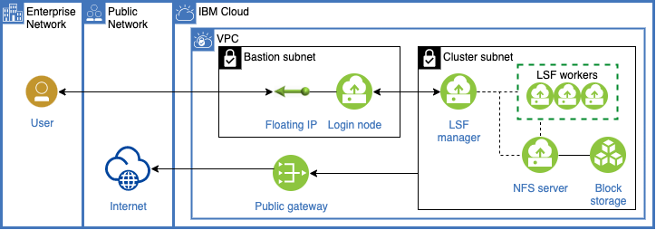

GATK on LSF on IBM Cloud
========================

IBM Cloud offers an automation tool to deploy LSF cluster with Docker and a shared filesystem (SFS) pre-installed.
You can quickly test Cromwell on it to run GATK pipelines.
Detailed steps to deploy LSF on IBM Cloud is described in [IBM Cloud documentation](https://cloud.ibm.com/docs/ibm-spectrum-lsf?topic=ibm-spectrum-lsf-using-hpc-cluster).
Note: current releases of LSF images do not fully configure Docker (Releases after June 2022 automates it).
Please find how to configure it on [lsf-docker.md](./lsf-docker.md).

With a typical configuration, you can deploy LSF on IBM Cloud like the following architecture.

You can securely access LSF manager in virtual private cloud (VPC) using SSH via an isolated, bastion subnet.
Then, you can download and start Cromwell on it.
If you use files on cloud object storage, you can also install and use tools such as aws-cli to download them to SFS.

SFS is mounted at /home/lsfadmin/shared.
So, you need to specify it to the parameter "backend.providers.LSF.config.root" in cromwell.conf.
You also need to add "-v" parameter to mount ${cwd} to ${docker_cwd} for docker-run in "submit-docker" parameter.
By doing so, submitted jobs can read and write files on SFS.

[test/cromwell.conf](./test/cromwell.conf) is an example configuration.
You can also find steps to test HaplotypeCaller at [test/README.md](test/README.md)

For advanced usages, LSF on IBM Cloud can utilize its [auto-scaling feature](https://www.ibm.com/docs/en/spectrum-lsf/10.1.0?topic=providers-configuring-cloud-gen-2-lsf-resource-connector) according to its load.
Also, LSF can even enable to connect your on-premise cluster and storage to a cloud cluster with [job forwarding](https://cloud.ibm.com/docs/ibm-spectrum-lsf?topic=ibm-spectrum-lsf-set-up-multi-cluster-job-forwarding) and data manager.
